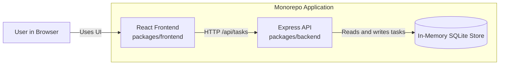
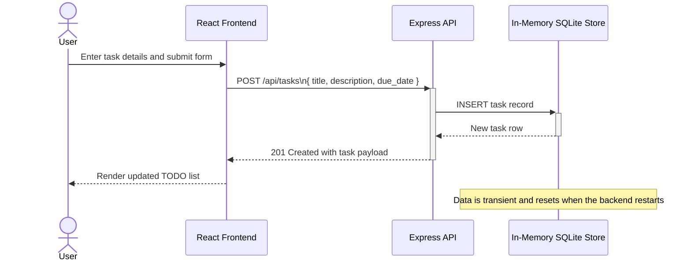

# Cloud Architecture Overview

This repository is a monorepo for a simple TODO application with a browser-based frontend and a backend API. The current implementation is optimized for local development and keeps task data in memory, so data is reset when the backend restarts.

## System Context

Preview source: `docs/diagrams/system-context.mmd`

## Create TODO Sequence

Preview source: `docs/diagrams/create-todo-sequence.mmd`

## Notes

- The React frontend provides the TODO application user interface.
- The Express backend exposes task management endpoints under `/api/tasks`.
- The backend uses an in-memory SQLite database, which behaves like a transient in-memory store for local development.
- Because the data store is in memory, task data does not persist across backend restarts.
- If Mermaid preview is opened against this Markdown file, some tools may try to parse the entire document as Mermaid. Use the `.mmd` files above for Mermaid-only preview.

## Diagram Sources

- `docs/diagrams/system-context.mmd`
- `docs/diagrams/create-todo-sequence.mmd`